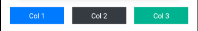

# react-native-rncn

## How to use

Wrap your App in StylesProvider and pass your styles object as value

```jsx
import React, { useState } from "react"
import { defaultStyles, defaultTheme, StylesProvider, View, Pressable, Text } from "react-native-rncn"

const styles = defaultStyles(defaultTheme)

function App() {
  const [selected, setSelected] = useState(false)

  return (
    <StylesProvider value={styles}>
      <View className="flex1 alignItemsCenter centerAll">
        <Pressable onPress={() => setSelected(!selected)} className={["pdv8 pdh12 rounded", selected && "bgSuccess"]}>
          <Text className={[selected && "textLight"]}>Press me senpai!</Text>
        </Pressable>
      </View>
    </StylesProvider>
  )
}

export default App
```

### Priority:

Class names are applied from the className prop in left to right order and then styles passed from style prop are applied

eg. `<View className="bgBlue bgRed" />` Here bgRed will take priority above bgBlue

`<View className="bgBlue bgRed" style={{ backgroundColor: '#e7e7e7' }} />` Here bgRed will take priority above bgBlue and backgroudndColor from style will take priority above that so result will be bg #e7e7e7

### Theming:

You can pass in a custom theme same as the below object in defaultStyles() to put your colors in default theme

```jsx
import { defaultStyles } from "react-native-rncn"

const theme = {
  colors: {
    brand: "#0b4353",
    primary: "#0b4353",
    secondary: "#6c757d",
    success: "#06B191",
    danger: "#ef375c",
    warning: "#D9A028",
    info: "#17a2b8",
    light: "#f8f9fa",
    dark: "#343a40",
    white: "#fff",
    muted: "#7C858D",
    transducent: "rgba(255,255,255,0.17)",
    transparent: "transparent",
    borderColor: "#dee2e6"
  },
  sizes: {
    borderRadiusRounded: 8,
    borderRadiusRoundedSm: 4,
    borderRadiusRoundedLg: 14,
    borderRadiusPill: 1000
  }
}

const styles = defaultStyles(theme)
```

#### Colors:

For views: bg[Brand|Primary|Secondary|Warning|Info|Light|Dark|White|Muted|Transparent]

For border: border[Brand|Primary|Secondary|Warning|Info|Light|Dark|White|Muted|Transparent]

For text: text[Brand|Primary|Secondary|Warning|Info|Light|Dark|White|Muted|Transparent] (only works on Text)

```jsx
<Text className="bgPrimary textSecondary borderDark" />
```

#### Sizing:

n can be one of 2,4,6,8,12,14,16,18,24

For padding: pd[n], pdh[n], pdv[n], pdt[n], pdb[n], pdr[n], pdl[n]

For margin: mg[n], mgh[n], mgv[n], mgt[n], mgb[n], mgr[n], mgl[n]

order: all sides, horizontal, vertical, top, bottom, right, left

```jsx
<View className="pdv8 pdh12 mgv4 mgh18" />
```

For borders n can be one of 0,1,2,4,6

For border width: border[n], borderTop[n], borderBottom[n], borderLeft[n], borderRight[n]

If you add multiple eg. `<View className="mg8 mgt18" />` here left, right, bottom will have margin 8 and on top you will have margin 18

#### Flexbox:

For Row:

Use classname "row" to create a row which will have margin -18 and use classname "col" in its children to create columns with flex 1 which have margin of 16 between them, "col" is same as applying "flex1 mgh8"

eg.

```jsx
<View className="row">
  <View className="col bgPrimary alignItemsCenter pd8">
    <Text className="textLight">Col 1</Text>
  </View>
  <View className="col bgDark alignItemsCenter pd8">
    <Text className="textLight">Col 2</Text>
  </View>
  <View className="col bgSuccess alignItemsCenter pd8">
    <Text className="textLight">Col 3</Text>
  </View>
</View>
```



Note: if you use bgPrimary or any background color on row it will bleed out so wrap the row View in another View and give that view a background color like

```jsx
<View className="bgWarning">
  <View className="row">
    <View className="col bgPrimary alignItemsCenter pd8">
      <Text className="textLight">Col 1</Text>
    </View>
    <View className="col bgDark alignItemsCenter pd8">
      <Text className="textLight">Col 2</Text>
    </View>
    <View className="col bgSuccess alignItemsCenter pd8">
      <Text className="textLight">Col 3</Text>
    </View>
  </View>
</View>
```


If you just want a flexDirection row and flex items in it use:

```jsx
<View className="flexRow">
  <View className="flex1 bgPrimary alignItemsCenter pd8">
    <Text className="textLight">Col 1</Text>
  </View>
  <View className="flex3 bgDark alignItemsCenter pd8">
    <Text className="textLight">Col 2</Text>
  </View>
  <View className="flex1 bgSuccess alignItemsCenter pd8">
    <Text className="textLight">Col 3</Text>
  </View>
</View>
```


The flex system is same as bootsrap 12 column:
available flex classes: flex[n]
n can be between 1-12

##### Other classes:

For wrapping use flexWrap

To center from all sides use centerAll

Other align and justify:

align[Center|Start|End|Strech]

justify[Center|Start|End|Evenly|Between|Around]

For width and height:

width[25,33,50,66,75,100]

height[25,33,50,66,75,100]

#### Text:

You can apply default styles for all text by adding `textDefault` in your styles. Default is
textDefault: { fontSize: 14, color: '#3d3d3d', }

```jsx
<Text className="h1">h1 heading</Text>
<Text className="h2">h2 heading</Text>
<Text className="h3">h3 heading</Text>
<Text className="h4">h4 heading</Text>
<Text className="h5">h5 heading</Text>
<Text className="p">
Lorem ipsum dolor, sit amet consectetur adipisicing elit. Id
eaque cum veniam ullam architecto? Perferendis sunt eaque
obcaecati perspiciatis. Nihil aperiam animi unde quo ipsum
consequatur fugit ex voluptatem voluptatum.
</Text>
<Text className="sm">small text</Text>
<Text className="xsm">extra small text</Text>
```


#### Border radius:

For all sides: rounded, roundedLg, roundedSm, roundedPill

For two sides: border[Top|Bottom][rounded|roundedlg|roundedsm]

For specific side:

border[Top|Bottom][left|right][Rounded|RoundedSm|RoundedLg]

Example:

```jsx
<View className="rounded borderTopRounded borderBottomRightRoundedLg" />
```


#### Positioning:

Use positionRelative on view you want to position relative to

Use positionAbsolute to position view absolutely

To position on sides use: position[Top|Bottom][left|right]

```jsx
<View className="positionRelative bgDark" style={{ width: 200, height: 200 }}>
  <View className="positionAbsolute positionTopRight bgDanger" style={{ height: 25, width: 25 }} />

  <View className="positionAbsolute positionTopLeft bgWarning" style={{ height: 25, width: 25 }} />

  <View className="positionAbsolute positionBottomRight bgInfo" style={{ height: 25, width: 25 }} />

  <View className="positionAbsolute positionBottomLeft bgPrimary" style={{ height: 25, width: 25 }} />
</View>
```


#### Elevation

For elevation use: elevation[n] where n is between 1-24

#### LinearGradient

Classnames as expected
Colors is array of colors in order they are to show
Direction can be between 0-360 or 'to right'|'to left'|'to bottom'|'to top'|'to top right'|'to top left'|'to bottom left'|'to bottom right'

```jsx
<LinearGradient className="roundedSm" colors={["#283048", "#859398"]} direction="to bottom">
  <Text className="pdh18 pdv6 textLight">Hello</Text>
</LinearGradient>
```


#### RadioGroup

```jsx
const [selected, setSelected] = useState(null)

<RadioGroup
  value={selected}
  onChangeValue={(option) => setSelected(option.value)}
  options={[
    { label: "Bar", value: "bar" },
    { label: "Foo", value: "foo" },
    { label: "Baz", value: "baz" },
    { label: "Another", value: "another" },
  ]}
/>
```


For multiple selection

```jsx
const [selected, setSelected] = useState([])

<RadioGroup
  isMulti
  value={selected}
  onChangeValue={(option) => selected.includes(option.value) ? setSelected([...selected].filter(({value}) => value !== option.value) : setSelected([...selected, option.value])}
  options={[
    { label: "Bar", value: "bar" },
    { label: "Foo", value: "foo" },
    { label: "Baz", value: "baz" },
    { label: "Another", value: "another" },
  ]}
/>
```
